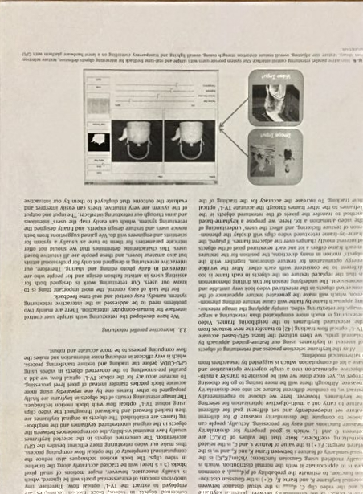

# water-filling-python

## Installation
```shell
$ pip install git+https://github.com/S-aiueo32/water-filling-python.git
```

## Usage
```shell
$ water-filling path/to/input/image --output path/to/output/image
```

## Result
|Input|Output|
|---|---|
|||
|||
|||

These data are provided by the authors ([more details](https://www.dropbox.com/s/dngblakxcvc6ced/0525-supp.zip?dl=0)). 

## References
- S. Jung, M. A. Hasan, and C. Kim, “Water-filling: An efficient algorithm for digitized document shadow removal,” in Computer Vision – ACCV 2018, Cham: Springer International Publishing, 2019, pp. 398–414.
- https://github.com/seungjun45/Water-Filling